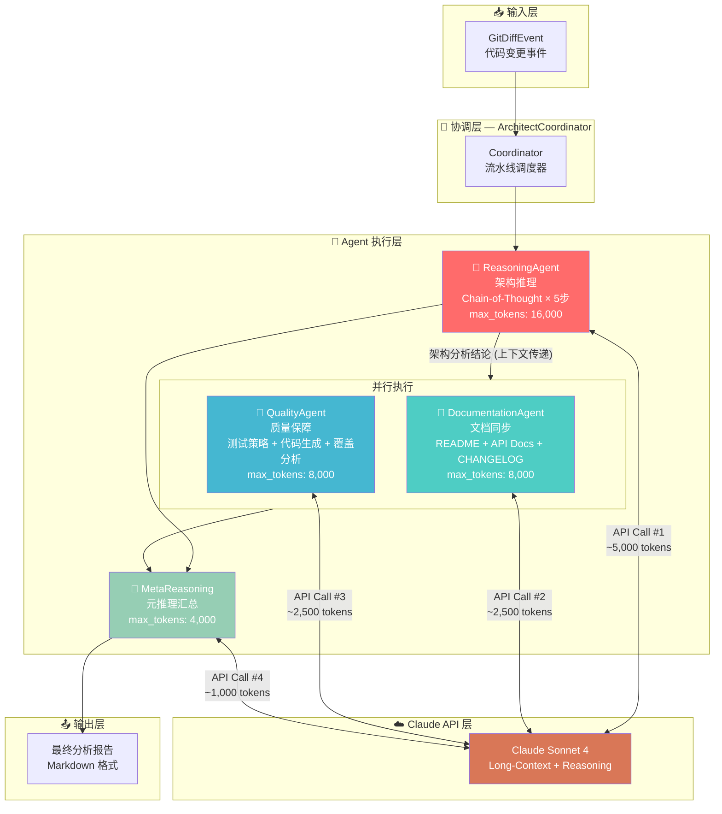

[README.md](https://github.com/user-attachments/files/27266928/README.md)
# 🏗️ Claude Architect Agent# ️ 克劳德架构师智能体

<div align="center">

**A Multi-Agent Collaborative Automated R&D Hub — Powered by Claude****多智能体协同自动化研发 hub — 由Claude提供支持**

[](https://python.org)
[](https://anthropic.com)[](https://anthropic.com)
[](LICENSE)[](许可证)
[](tests/)[](测试/)
[](https://github.com/astral-sh/ruff)[](https://github.com/astral-sh/ruff)

*监听代码变更 → 深度架构推理 → 自动更新文档 → 生成测试用例*

</div>

---

## 📖 项目背景

在现代软件工程中，代码审查（Code Review）往往是研发流程中最耗时、最依赖专家经验的环节。一次高质量的架构审查需要：

- **深度上下文理解**：不只是看单个文件的改动，而是评估变更在整个系统中的连锁影响
- **多维度专业判断**：安全性、性能、可维护性、向后兼容性缺一不可
- **文档同步**：代码变了，文档却没跟上，是技术债务的主要来源之一
- **测试保障**：基于变更逻辑生成针对性测试，而非泛化的通用测试

**Claude Architect Agent** 通过构建一个多 Agent 协作系统，将这些原本需要资深工程师数小时完成的工作，压缩为自动化的 AI 流水线，每次代码变更都能在分钟级内获得：

1. 深度架构影响评估报告
2. 同步更新的项目文档
3. 基于变更逻辑生成的单元测试套件

---

## 🏛️ 技术架构



---

## 🧠 How It Uses Claude's Long-Context & Reasoning

这是本项目的核心设计理念，也是高 Token 消耗的根本原因：

### 1. 长上下文传递（Long-Context Chaining）

```
GitDiff (可达数千行)
    │
    ▼ 注入推理 Agent 的完整 Prompt
ReasoningAgent Prompt ≈ 3,000~8,000 tokens
    │
    ▼ 推理结论（约 2,000 tokens）注入下游 Agent
DocumentationAgent Prompt ≈ 5,000~10,000 tokens
QualityAgent Prompt       ≈ 5,000~10,000 tokens
    │
    ▼ 三 Agent 结论汇总注入协调器
Coordinator Prompt ≈ 3,000~5,000 tokens
```

**每个 Agent 都接收来自上游的完整上下文**，而非摘要截断版本。这确保了下游 Agent 在做判断时，拥有完整的推理链作为依据，避免信息丢失导致的错误级联。

### 2. 五步链式推理（5-Step Chain of Thought）

推理 Agent 的 Prompt 强制模型按照固定的五步框架进行推理，**每一步都明确依赖上一步的结论**：

| 步骤 | 任务 | 输出形式 |
|------|------|---------|
| Step 1 | 变更意图识别 | 自然语言分析 |
| Step 2 | 直接影响评估 | 模块依赖列表 |
| Step 3 | 级联影响推理 | 二阶/三阶影响图 |
| Step 4 | 架构风险量化 | 1-10 评分矩阵 |
| Step 5 | 综合结论与建议 | APPROVE/BLOCK 决策 |

这种设计让 Claude 无法"跳步"得出结论，必须展示完整的推理过程，从而显著提升分析质量。

### 3. 多 Agent 上下文共享（Inter-Agent Context）

```python
# coordinator.py 核心调度逻辑
reasoning_result = await self.reasoning_agent.analyze(event)

# 推理结论作为上下文，注入文档和测试 Agent
doc_result, test_result = await asyncio.gather(
    self.doc_agent.generate_docs(event, reasoning_result),   # ← 携带推理上下文
    self.quality_agent.generate_tests(event, reasoning_result),  # ← 携带推理上下文
)
```

文档和测试 Agent 不是独立工作的，而是基于推理 Agent 发现的风险点来决定：
- 哪些 API 变更需要重点更新文档
- 哪些高风险模块需要优先生成测试

### 4. Token 消耗分布

| Agent | 角色 | 典型 Token 消耗 | 消耗原因 |
|-------|------|---------------|---------|
| 🧠 ReasoningAgent | 架构推理 | 8,000 ~ 16,000 | 完整 diff + 5步推理链 |
| 📝 DocumentationAgent | 文档生成 | 4,000 ~ 8,000 | 推理结论 + 完整文档生成 |
| 🧪 QualityAgent | 测试生成 | 4,000 ~ 8,000 | 推理风险 + 完整测试代码 |
| 🎯 Coordinator | 元推理 | 2,000 ~ 4,000 | 三 Agent 结论汇总 |
| **合计** | — | **~18,000 ~ 36,000** | 单次代码审查 |

---

## 📁 项目结构

```
Claude-Architect-Agent/
├── agents/                     # 专职 Agent 模块
│   ├── __init__.py
│   ├── reasoning_agent.py      # 🧠 架构推理 Agent（5步 CoT）
│   ├── documentation_agent.py  # 📝 文档同步 Agent
│   └── quality_agent.py        # 🧪 质量保障 Agent
│
├── core/                       # 核心框架层
│   ├── __init__.py
│   ├── config.py               # 全局配置、数据类定义
│   └── coordinator.py          # 🎯 多 Agent 协调器（主调度器）
│
├── prompts/                    # Prompt 模板库
│   ├── __init__.py
│   └── templates.py            # 所有 Agent 的系统提示词与用户模板
│
├── utils/                      # 工具层
│   ├── __init__.py
│   └── claude_client.py        # Claude API 封装（含 Token 统计）
│
├── tests/                      # 测试套件
│   ├── __init__.py
│   └── test_coordinator.py     # 单元 + 集成测试（pytest + mock）
│
├── examples/                   # 演示用例
│   ├── __init__.py
│   └── demo_scenario.py        # JWT → OAuth2 重构场景演示
│
├── docs/                       # 补充文档
│   └── architecture.md         # 详细架构说明
│
├── README.md
├── requirements.txt
└── pyproject.toml
```

---

## 🚀 快速开始

### 1. 克隆与安装

```bash
git clone https://github.com/your-username/Claude-Architect-Agent.git
cd Claude-Architect-Agent

# 创建虚拟环境
python -m venv .venv
source .venv/bin/activate  # Windows: .venv\Scripts\activate

# 安装依赖
pip install -r requirements.txt
```

### 2. 配置 API Key

```bash
# 在项目根目录创建 .env 文件
echo "ANTHROPIC_API_KEY=sk-ant-your-key-here" > .env
```

### 3. 运行演示场景

```bash
# JWT → OAuth2 + PKCE 认证重构场景（高复杂度演示）
python examples/demo_scenario.py
```

**预期输出：**
```
🚀 🚀 🚀 Claude Architect Agent — 演示场景
════════════════════════════════════════════════════════════
  🏗️  Claude Architect Agent — 多 Agent 分析流水线
════════════════════════════════════════════════════════════
  📦 仓库:  myapp/backend-api
  📝 提交:  a3f9c2d — refactor(auth): 将认证系统从 JWT 迁移至 OAuth2...
  👤 作者:  zhang.wei@company.com
  📁 文件:  auth/jwt_handler.py → auth/oauth2_handler.py, models/user.py...
════════════════════════════════════════════════════════════

────────────────────────────────────────────────────────────
  Phase 1/3 | 🧠 架构推理分析
────────────────────────────────────────────────────────────
  ✅ 🧠 架构推理 Agent | tokens=12,847
     └─ [1] Step 1 — 变更意图识别: 这是一次高风险的安全架构迁移...
     └─ [2] Step 4 — 架构风险量化: 安全性影响: 9/10（正向）...

  Phase 2/3 | 📝 文档生成 & 🧪 测试生成（并行）
────────────────────────────────────────────────────────────
  ✅ 📝 文档同步 Agent | tokens=6,234
  ✅ 🧪 质量保障 Agent | tokens=7,891

  Phase 3/3 | 🎯 元推理 & 最终报告生成
────────────────────────────────────────────────────────────

════════════════════════════════════════════════════════════
📊 Token 使用报告
════════════════════════════════════════════════════════════
  总调用次数: 4
  总 Token 消耗: 29,847

  按 Agent 分类:
    • reasoning           调用=1 | tokens=12,847 | avg_latency=4823ms
    • documentation       调用=1 | tokens=6,234  | avg_latency=2341ms
    • quality             调用=1 | tokens=7,891  | avg_latency=2987ms
    • coordinator         调用=1 | tokens=2,875  | avg_latency=1203ms
════════════════════════════════════════════════════════════

✅ 分析报告已保存至: demo_analysis_report.md
```

### 4. 运行测试

```bash
# 运行全部测试（使用 Mock，无需真实 API Key）
pytest tests/ -v

# 只运行单元测试
pytest tests/ -v -m unit

# 带覆盖率报告
pytest tests/ --cov=. --cov-report=html
```

---

## 🔌 集成到自己的项目

```python
import asyncio
from core.config import GitDiffEvent
from core.coordinator import ArchitectCoordinator

async def analyze_commit(diff: str, files: list[str]) -> str:
    event = GitDiffEvent(
        repo_name="your-repo",
        commit_hash="abc1234",
        author="dev@company.com",
        commit_message="your commit message",
        changed_files=files,
        diff_content=diff,
    )
    coordinator = ArchitectCoordinator()
    return await coordinator.process(event)

# 在 GitHub Actions / GitLab CI 中调用
report = asyncio.run(analyze_commit(diff_text, changed_files))
print(report)
```

---

## 🛠️ 扩展指南

### 添加新 Agent

1. 在 `agents/` 下创建新文件，继承相同的接口模式
2. 在 `prompts/templates.py` 添加对应的 Prompt 模板
3. 在 `core/config.py` 的 `AGENT_ROLES` 中注册新角色
4. 在 `core/coordinator.py` 的 `process()` 方法中加入调度逻辑

### 接入真实 Git Webhook

```python
# 示例：Flask Webhook 处理器
@app.route("/webhook/github", methods=["POST"])
async def github_webhook():
    payload = request.json
    diff = fetch_pr_diff(payload["pull_request"]["number"])
    event = GitDiffEvent(
        repo_name=payload["repository"]["full_name"],
        commit_hash=payload["pull_request"]["head"]["sha"][:7],
        ...
    )
    coordinator = ArchitectCoordinator()
    report = await coordinator.process(event)
    post_pr_comment(report)  # 将报告回写到 PR 评论
```

---

## 📊 演示场景详解：JWT → OAuth2 + PKCE 重构

本项目附带了一个高复杂度的演示场景，用于体现多 Agent 系统的真实价值：

**变更内容：**
- `auth/jwt_handler.py` → 完全重写为 `auth/oauth2_handler.py`（引入 PKCE 挑战码机制）
- `models/user.py` → 移除 `username`、`password_hash` 字段，新增 OAuth2 相关字段（**Breaking Change**）
- `api/v1/auth_router.py` → 接口从 `POST /auth/login` 重构为 OAuth2 授权码流程

**为什么这个场景需要 ~30,000 tokens：**

| 推理阶段 | 复杂度来源 | Token 消耗 |
|---------|-----------|-----------|
| 变更意图识别 | 同时涉及安全架构、数据模型、API 设计三个层面 | ~1,500 |
| 直接影响评估 | 数据库 Schema 变更 → 需要分析迁移脚本的完整性 | ~2,000 ||直接影响评估|数据库模式变更 → 需要分析迁移脚本的完整性| ~2,000 |
| 级联影响推理 | 所有使用 `/auth/login` 的客户端均需适配 | ~2,500 |
| 架构风险量化 | 安全性改善 vs. 引入 Redis 依赖的可用性风险 | ~2,000 |
| 综合结论 | APPROVE with mandatory steps（含具体行动项）| ~1,500 |
| 文档更新 | API 文档完全重写（含 OpenAPI 描述）| ~6,000 |
| 测试生成 | PKCE 流程的完整测试矩阵 | ~7,500 |
| 元推理汇总 | 三 Agent 结论的交叉验证 | ~2,500 |

---

## 📄 许可证

MIT License — 详见 [LICENSE](LICENSE)

---

<div align="center">

Built with ❤️ and Claude by [Your Name]由 ❤️ 和 Claude 构建，由[您的姓名]

*"The best code review is one where every risk is found before production."**“最佳代码评审是在上线前发现所有风险的评审。”*

</div>
